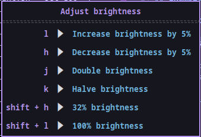
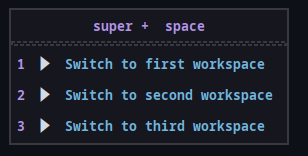
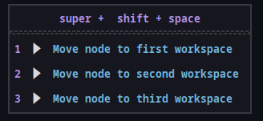

## sxhkd-whichkey

This utility is similar in functionality to [which-key](https://github.com/folke/which-key.nvim) for neovim, but for the hotkey daemon, [sxhkd](https://github.com/baskerville/sxhkd).

sxhkd is excellent. I like grouping similar hotkeys under a common mnemonic prefix. But I have trouble remembering all my hotkeys. In neovim, I don't have this issue, thanks to which-key. This project enables which-key-like functionality for sxhkd, with minimal setup required.

When a chain is active, sxhkd-whichkey will show the continuations of the current chain in a small GUI window. When the chain is aborted, the window disappears. The chain is aborted if it times out. If you find the timeout too short, it can be configured in when launching sxhkd with the `-t` flag. The timeout cannot be configured in `sxhkd-whichkey`, which will only show chains exactly when they are active.

## Setup

An sxhkd status-fifo is required for this to work. A fifo can be created with `mkfifo <STATUS_FIFO>`. sxhkd must be started with `sxhkd -s <STATUS_FIFO>`.

That's it! By default, the description of each rule in the GUI window is the command which the hotkey will execute.
To improve sxhkd-whichkey experience, I recommend enriching your sxhkdrc with comments.

## Running

```bash
git clone --recurse-submodules https://github.com/Operdies/sxhkd-whichkey
cd sxhkd-whichkey
cargo run -- -s <STATUS_FIFO>
```

## Examples

### Brightness

I use this hotkey for controlling brightness. Notice the line comments in each rule. The placeholder `$(2)` is expanded to the second argument (0-indexed) in the expanded command.

```bash
super + b : { h, l, j, k, shift + h, shift + l }
  ~/.config/sxhkd/scripts/backlight.sh {   \
     --dec 5 # Reduce brightness by $(2)%,\
     --inc 5 # Increase brightness by $(2)%,\
     --halve # Halve brigtness,\
     --double # Double brightness,\
     --set 32 # $(2)% brightness,\
     --set 100 # $(2)% brightness \
    }
```



### Argument Mapping

Here is a (maybe contrived) example of mapping positional arguments to strings.
A mapping is of the form `name:value` where name and value can optionally be quoted. Mappings must precede the description. During parsing, when something is encountered which is not a valid mapping, the rest of the comment is assumed to be the description.

```bash
super + { space, shift + space } : {1-3}
  bspc {desktop -f, node -d} '^{1-3}' #\
  ^1:first ^2:second ^3:third \
  desktop:"Switch to $(3) workspace" \
  node:"Move node to $(3) workspace" \
  $(1)
```

| desktop -f                                    | node -d                                 |
| --------------------------------------------- | --------------------------------------- |
|  |  |

In this case, the flags `^1/^2/^3` are mapped to `first/second/third`, and the flags `desktop/node` are mapped to a string which references the 3rd positional argument. The actual description is simply `$(1)`, which is expanded to the first positional argument (`node/desktop`), which was mapped to a string which itself contains expansions.

# Gotchas

- Line comments are not really line comments. They are sent verbatim to the shell by sxhkd.
- Line breaks are not valid in an sxhkd rule, so there is no way to terminate a line comment, except by a comma or `}` which terminates the rule.
- sxhkd interprets commas in a comment as a chord separator if it appears within curly braces, even if commented. To use a comma in a description in braces, it must be escaped. Example:

```bash
# Consider this rule
super + {a,b}
    echo { "hello a" # a comment, including a comma \
    echo "hello b"\
  }

# sxhkd expands this rule like this:
super + a
  echo "hello a" # a comment
super + b
  including a comma echo "hello b"
```

But by escaping the comma, we get:

```bash
super + {a,b}
    echo { "hello a" # a comment\, including an escaped comma \
    echo "hello b"\
  }

# sxhkd expands this rule like this:
super + a
  echo "hello a" # a comment, including an escaped comma
super + b
  echo "hello b"
```
